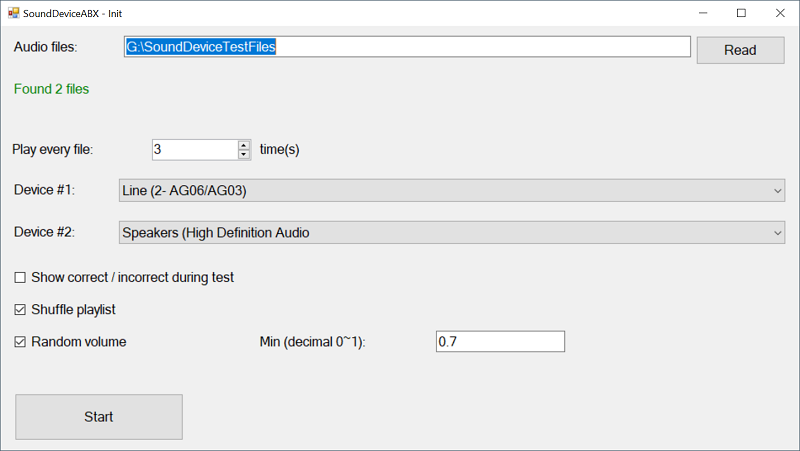
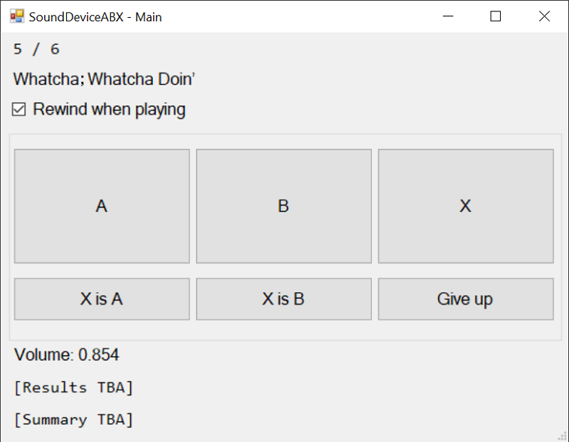

SoundDeviceABX
---

Can you _really_ distinguish between your sound output devices?

SoundDeviceABX is a tool that runs ABX tests for sound output devices, like sound cards, DACs, etc.
In each test, one of the two devices (A, B) is assigned as a challenge device (X).
The user listens to music from A/B/X, and tries to figure out whether X is A or B.

To use it, first connect both devices to the same output, e.g. via a mixer.

### Features

- Choose a folder of music files
- Set the number of times each file is tested
- Choose two sound devices to test with
- Shuffle the playlist
- Before the first test starts, play with both devices to adjust their volume to even
- Randomize volume each time a track is played, so that a small difference in output volume doesn't matter

### Dependencies

SoundDeviceABX uses [NAudio](https://github.com/naudio/NAudio) to handle files and devices.

It's built with WinForms and .Net Framework 4.8.

### License

MIT License
